# Setting Up Claude for the Academic AI Library Workshop

**A step-by-step installation guide for workshop participants**

---

## About this guide

This guide walks you through installing the Claude desktop application on your own computer and connecting it to the Amazon Bedrock account the workshop provides. When you finish, you will be able to open Claude Cowork, point it at the workshop folder, and begin the exercises.

You do not need any programming experience. You will not write code, use a command line, or install developer software. You will, however, turn on a setting called Developer Mode. That name is misleading: in this context it does nothing more than reveal the menu that lets you tell Claude which company's servers to use. There is an explanation of what it does and does not do at the end of this guide, in case the name gives you pause.

Set aside about twenty minutes. Most of that is downloading and waiting.

The figures in this guide are simplified diagrams rather than photographs of a screen. They show where to look and what to click. The application is updated often, so expect the wording and arrangement on your own screen to differ in small ways; match by meaning rather than by appearance.

If you get stuck at any point, stop and contact the workshop facilitator rather than working around the problem. A misconfigured connection is much easier to diagnose before you have changed several other settings.

---

## Before you start

Collect these four things. Three of them come from your facilitator on a credential card, either printed or sent to you directly.

| What you need | Where it comes from | What it looks like |
|---|---|---|
| A computer running macOS 11 (Big Sur) or later, or Windows 10 or later | Your own machine | — |
| Your Claude account sign-in, **on a paid plan** | Your institution, or the account you registered for the workshop | An email address and password, or a single sign-on button |
| A Bedrock API key | Facilitator's credential card | One long unbroken string of characters |
| An AWS region | Facilitator's credential card | Something like `us-east-1` |
| A model identifier | Facilitator's credential card | Something like `us.anthropic.claude-sonnet-4-5-20250929-v1:0` |
| Two practice skills | Facilitator, sent separately | Two files whose names end in `.skill`; you install them in Step 8 |

You also need the workshop folder on your computer. Download it yourself from the workshop repository's releases page:

**https://github.com/jhu-sheridan-libraries/academic-ai-library-workshop/releases/tag/workshop-materials**

Take the file called **`library-context.zip`**, unzip it, and note where it lives — your Documents folder is fine. Inside you will find a folder called `library-context`. That folder, the one that directly contains `WORKSPACE-BRIEF.md` and `sample-data`, is the one you point Claude at in Step 7. If your facilitator sent you the archive directly instead, use that; it is the same thing.

**Download the release asset, not the whole repository.** Cloning or downloading the repository gets you the application source code, the facilitator's materials, and a set of notes that spoil several exercises. It is also far larger than you need. The zip on the releases page contains exactly the workshop folder and nothing else, which is the point — and connecting the narrowest folder that holds what you need is a habit the first exercise is about.

**Check the plan before you start installing.** Cowork, the part of the application the whole workshop runs in, needs a paid Claude plan — Pro, Max, Team, or Enterprise. It is not in the free tier, and on a Team or Enterprise account an administrator may additionally need to switch it on. This is worth confirming now rather than after you have installed the application and configured a credential: sign in at claude.ai and check that a **Cowork** tab appears alongside Chat and Code. If it does not, send your facilitator a screenshot before going further, because it is not something you can fix from your own settings.

**A note on the API key.** The key is a password. It authorizes spending against the workshop's Amazon account. Do not post it in a shared chat, commit it to a repository, paste it into a support ticket, or forward it to a colleague who missed the session. If you think it has been exposed, tell your facilitator; keys are quick to revoke and reissue, and nobody will be annoyed with you for reporting it.

---

## Step 1 — Download the application

Open a web browser and go to:

**https://claude.com/download**

The page detects your operating system and offers the matching installer. If it offers the wrong one, there are links for each platform further down the page.

- On **macOS** you will download a file ending in `.dmg`.
- On **Windows** you will download a file ending in `.exe`.

> **Figure 1 — The download page**
>
> 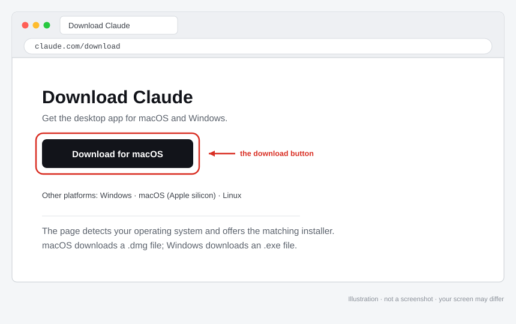
>
> <!-- Capture: the full browser window at https://claude.com/download, showing the primary download button.
>      Highlight: draw a box around the download button. -->

---

## Step 2 — Install the application

### On macOS

1. Open the downloaded `.dmg` file. It will appear in your Downloads folder or in your browser's downloads list.
2. A window opens showing the Claude icon and a shortcut to your Applications folder. Drag the Claude icon onto the Applications folder.
3. Wait for the copy to finish, then close the window. You can eject the disk image from the Finder sidebar.
4. Open your Applications folder and double-click Claude.
5. macOS will ask whether you are sure you want to open an application downloaded from the internet. This is normal and appears for every application not installed through the App Store. Click **Open**.

> **Figure 2 — The macOS install window**
>
> 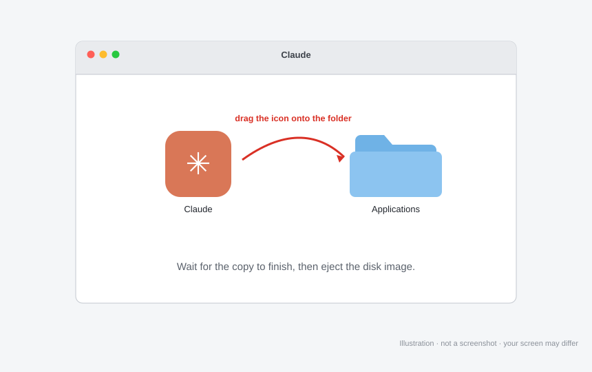
>
> <!-- Capture: the mounted disk image window showing the Claude icon and the Applications folder shortcut.
>      Highlight: draw an arrow from the Claude icon to the Applications folder. -->

> **Figure 3 — The macOS first-launch prompt**
>
> 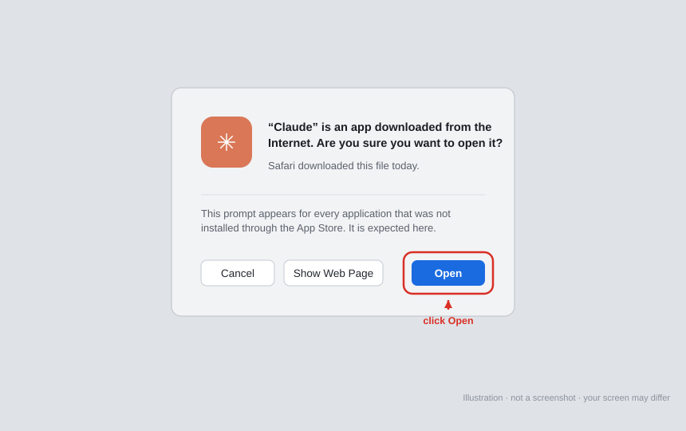
>
> <!-- Capture: the dialog asking whether you want to open an application downloaded from the internet.
>      Highlight: draw a box around the Open button. -->

### On Windows

1. Open the downloaded `.exe` file from your Downloads folder or your browser's downloads list.
2. Windows may show a blue screen headed "Windows protected your PC". This appears for newly published installers and does not mean anything is wrong. Click **More info**, check that the publisher is listed as Anthropic, then click **Run anyway**.
3. Follow the installer prompts. The defaults are correct; you do not need to change the install location.
4. When the installer finishes, open Claude from the Start menu.

> **Figure 4 — The Windows SmartScreen prompt**
>
> 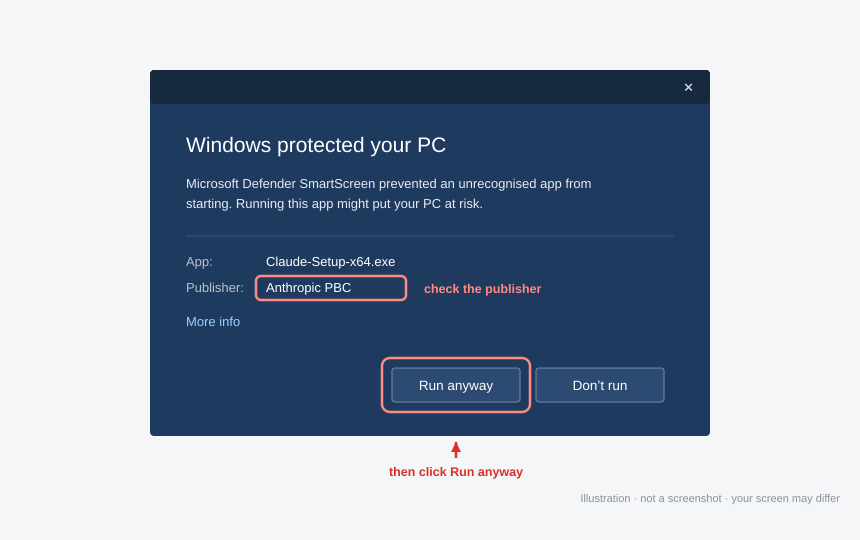
>
> <!-- Capture: the "Windows protected your PC" dialog after clicking More info, with the publisher name visible.
>      Highlight: draw boxes around the publisher name and the Run anyway button. -->

---

## Step 3 — Do not sign in yet

When Claude opens for the first time it shows a sign-in screen. Leave it there for a moment. The next step is easier to reach from this screen than from inside the application, particularly on Windows.

If you have already signed in, that is fine. Nothing is broken and you do not need to sign out.

---

## Step 4 — Turn on Developer Mode

This reveals the menu you need in Step 5. The path differs slightly between the two operating systems.

### On macOS

In the menu bar at the very top of the screen, choose:

**Help → Troubleshooting → Enable Developer Mode**

The menu bar belongs to the application, not to the Claude window, so look at the top edge of your display rather than inside the window itself.

### On Windows

Click the menu button — three stacked horizontal lines, sometimes called a hamburger menu — in the **top-left corner of the sign-in screen**, then choose:

**Help → Troubleshooting → Enable Developer Mode**

After you enable it, a new **Developer** menu appears. If you do not see it immediately, close and reopen Claude.

> **Figure 5 — Enabling Developer Mode (macOS)**
>
> 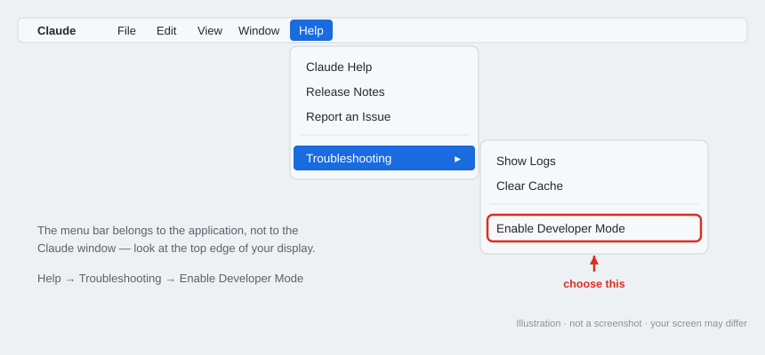
>
> <!-- Capture: the macOS menu bar with Help open and the Troubleshooting submenu expanded, so that Enable Developer Mode is visible.
>      Highlight: draw a box around Enable Developer Mode. -->

> **Figure 6 — Enabling Developer Mode (Windows)**
>
> 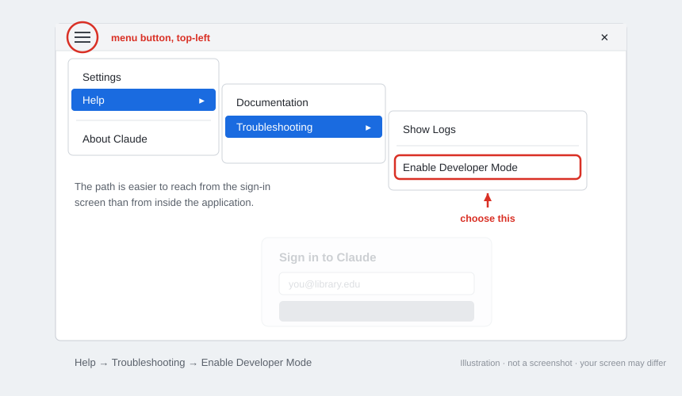
>
> <!-- Capture: the sign-in screen with the hamburger menu open and the Help → Troubleshooting path expanded.
>      Highlight: circle the hamburger button in the top-left, and draw a box around Enable Developer Mode. -->

---

## Step 5 — Connect Claude to Bedrock

Now tell Claude to send your requests to the workshop's Amazon Bedrock account instead of to Anthropic's own service.

From the newly visible menu, choose:

**Developer → Configure Third-Party Inference…**

A configuration window opens. Fill it in using the credential card from your facilitator:

1. For the **provider**, choose **Amazon Bedrock**. Other options such as Google Vertex AI may be listed; ignore them.
2. For the **authentication method**, choose the option for an **API key** or **bearer token**, rather than the options for AWS sign-in, a named profile, or a credential helper. Your facilitator issued you a key, which is the simplest of the four methods.
3. Paste the **API key** exactly as supplied. Copy and paste it rather than typing it. Take care not to include a trailing space, and check that your email or chat client has not inserted a line break in the middle of it.
4. Enter the **region**, for example `us-east-1`. It must match the card exactly.
5. Enter the **model identifier** from the card, for example `us.anthropic.claude-sonnet-4-5-20250929-v1:0`. The leading `us.` is part of the identifier and is required. Do not remove it.
6. Save the configuration and, if prompted, restart Claude.

The exact wording of the labels in this window may differ a little from the words above, since the application is updated frequently. Match by meaning rather than by exact phrase: one field takes the provider, one takes the key, one takes the region, and one takes the model.

> **Figure 7 — The Developer menu**
>
> 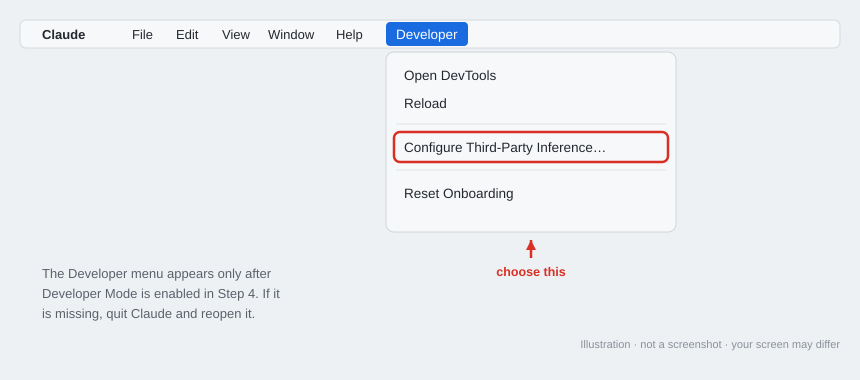
>
> <!-- Capture: the Developer menu open, showing Configure Third-Party Inference.
>      Highlight: draw a box around Configure Third-Party Inference. -->

> **Figure 8 — The third-party inference configuration window**
>
> 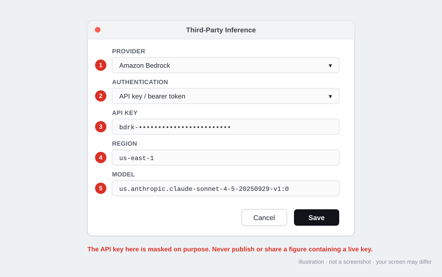
>
> <!-- Capture: the configuration window with Amazon Bedrock selected and every field filled in.
>      Highlight: number each field to match steps 1 through 5 above.
>      Before publishing this figure, replace the API key with a masked value such as bdrk-••••••••••••.
>      Do not distribute a screenshot containing a live key. -->

**If you have signed into AWS in this application before.** Claude accepts four kinds of Bedrock credential and uses whichever it finds first, in this order: an in-app AWS sign-in, a named profile, a credential helper, and last of all a bearer token. Your API key is a bearer token, so it sits at the bottom of that list. If an old AWS sign-in or profile is still configured, it will be used instead of your key and the workshop account will not be billed correctly. If you have any history of AWS configuration on this machine, clear it in this window before saving, or ask your facilitator to check the screen with you.

---

## Step 6 — Check that the connection works

Sign in to Claude if you have not already, then open a new conversation and send something short, such as:

> Reply with the single word: connected.

A normal reply means Claude reached Bedrock with your key and the workshop account is working. An error mentioning credentials, authorization, or an unrecognized model means something in Step 5 needs another look; see the troubleshooting table below.

One thing to know about running through Bedrock: web search is not included automatically. It reaches Claude through Anthropic's own infrastructure, which you are now bypassing, so a search provider has to be configured separately. Some other features that depend on Anthropic-hosted services may also be unavailable or behave differently. If you want the full detail, the current feature comparison is published at https://claude.com/docs/third-party/claude-desktop/feature-matrix.

The exercises are built around this, and none of them need web access at all. Every file they need is in the workshop folder, including a simulated AI research report that Module 2 examines in place of running a live search, a set of captured retrieval results — one per citation in that report — that you read instead of resolving a DOI or opening a publisher's landing page, and a fictional search platform with its own syntax help, thesaurus, and search history that Module 4 tests search syntax against instead of a subscription database. There is nothing to sign into and nothing to look up. If an exercise ever seems to require a search, a login, or a live page, that is a bug in the exercise; tell your facilitator.

---

## Step 7 — Open Cowork and connect the workshop folder

Cowork is the part of the application that can read and write files in a folder you choose. It is where the workshop exercises take place.

1. In the main Claude window, click the **Cowork** tab along the top, alongside Chat and Code.
2. Add the workshop folder as Cowork's working folder, using the option to add a local folder. Select the `library-context` folder you unzipped earlier — the one that directly contains `WORKSPACE-BRIEF.md` and `sample-data`, not the folder above it — then confirm.
3. Claude will confirm which folder it can see. Check that the path shown is the workshop folder and not your whole Documents folder or your home directory. Cowork can create and change files in the folder you give it, so give it the narrowest folder that contains what you need.

Inside the folder you will find `WORKSPACE-BRIEF.md`, which sets the standards Claude works to throughout the workshop, and a `sample-data` folder holding the simulated material the exercises use — a research request, an evidence log, a serials usage report, a draft AI research report, and a retrieved web page. Inside that there are three subfolders. `mock-sources/` holds the captured retrieval result for each citation in the draft report, so you check sources by opening a file rather than by going online. `mock-database/` holds a fictional search platform's syntax help, thesaurus extract, search session history, and name authority file, which is what Module 4 tests search syntax and authorized name forms against. `archives/` holds a reading room inquiry, a legacy finding aid, a digitization inventory, and an accession note; if you work in archives or special collections, those are the files your track uses. All of it is invented for teaching. Your own work will be written into this folder as you go, so by the end it also holds the briefs, matrices, logs, and records you produced.

This is the main way Cowork differs from a chat window, and it is worth pausing on. You will not upload files. The files are simply there, and Claude reads and writes them in place. When an exercise asks you to produce something, the result is a file you can open in Word, Excel, or a text editor after the workshop ends — not a block of text in a conversation you have to copy out before you lose it.

Cowork requires a paid Claude plan: Pro, Max, Team, or Enterprise. It is not part of the free tier. If the Cowork tab is missing, your account is most likely on the wrong plan, or, on a Team or Enterprise account, an administrator has not switched Cowork on for the organization. Either way this is not something you can fix from your own settings — send your facilitator a screenshot of your Claude window and they will sort it out.

Note that Cowork itself does not require Developer Mode. You enabled Developer Mode only to reach the Bedrock setting in Step 5.

> **Figure 9 — The Cowork tab**
>
> 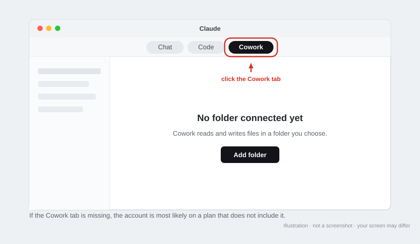
>
> <!-- Capture: the main Claude window with the Cowork tab selected.
>      Highlight: draw a box around the Cowork tab. -->

> **Figure 10 — Connecting the workshop folder**
>
> 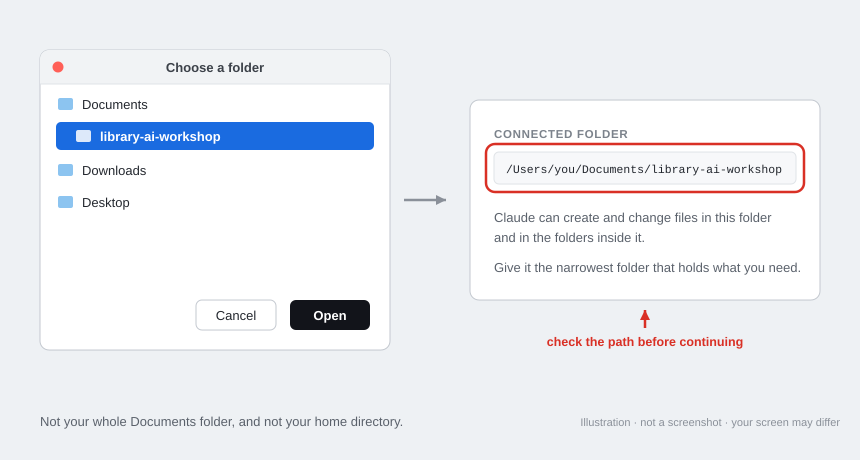
>
> <!-- Capture: the folder selection step, and then the confirmation showing the connected folder name.
>      Highlight: draw a box around the connected folder path. -->

---

## Step 8 — Add the two practice skills

Two of the workshop exercises are run by *skills* rather than by instructions you read off a page — the reference interview in Module 1 and the output review in Module 2. A skill is a set of instructions Claude loads by itself when it recognises the kind of task you are describing. Once a skill is saved you never have to name a file or paste anything in: you describe what you want in ordinary words and Claude picks it up.

Skills matter beyond those two exercises, which is why they are worth installing properly rather than treating as a formality. By the end of Module 4 you will write one yourself, turning the workflow you have built over the day into something your colleagues can load and use. The two below are the worked examples you learn from first.

Your facilitator will send you two files whose names end in `.skill`.

**Practice a library reference interview.** Claude plays a fictional patron while you practise the interview. It holds back the things a real patron would not think to volunteer, so you have to ask for the details that actually change a search, and it introduces at most one complication once you have established the core need. When you are done it steps out of character and debriefs what worked, which question came too late, and where a privacy or access boundary came up. It does not score you, and it does not run the search — the interview itself is the exercise.

**Review AI research output.** Claude audits an AI-assisted research output before you rely on it: whether each material claim is actually supported by the source cited for it, whether those sources exist and say what they are said to say, which perspectives or databases are missing, whether the calculations hold up, and whether another librarian could reproduce the search. It reports what it could not check instead of quietly treating unchecked as supported, and it leaves the professional judgment with you.

To install each one:

1. Save both files somewhere you can find them again.
2. Open one of them. Claude shows a card for the file with a **Save skill** button.
3. Click **Save skill**, then do the same for the second file.

Both skills are then available in every conversation, including ones you have already started.

To use them, describe the task rather than naming the skill:

> Practise a reference interview with me — intermediate difficulty, about fifteen minutes.

> Review this research scan before I send it to the patron.

**One thing to take seriously.** The review skill will ask you to remove or de-identify patron records, student data, health information, unpublished research, credentials, and licensed full text before you hand anything over. That is not a formality. Use the simulated material in the workshop folder, or genuinely public sources of your own, for these exercises.

> **Figure 11 — Saving a skill**
>
> 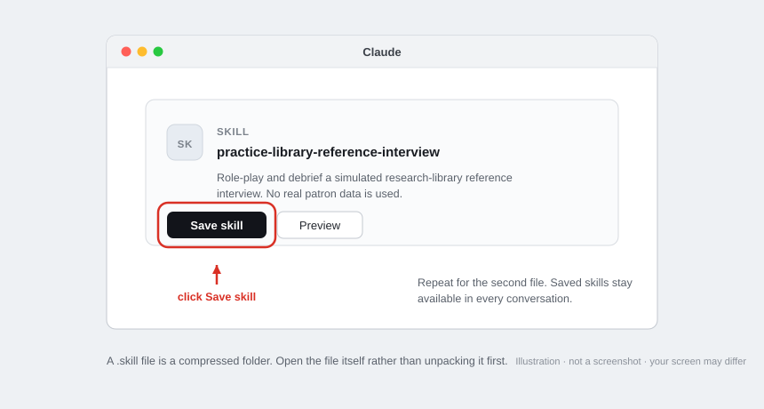
>
> <!-- Capture: the card Claude shows when a .skill file is opened, before it is saved.
>      Highlight: draw a box around the Save skill button. -->

---

## Step 9 — Start the workshop

The exercises themselves live on the workshop site, not in the connected folder. If you are reading this page on that site already, the modules are in the navigation at the top. If you are reading this as a file, open the site in a browser — your facilitator will have given you the address.

Work through the modules one exercise at a time. Each exercise tells you what to do, and where it supplies a prompt you can either copy it or click **Open in Claude Cowork**, which opens Claude with the prompt already in place. Keep the site in one window and Claude in another; you will be moving between them all the way through.

You are set up. Nothing else needs configuring.

Two things worth knowing before you begin. The site keeps track of which steps you have finished, so you can close it and come back later without losing your place — the course is designed to be done in pieces. And the work itself accumulates in the connected folder as real files, so by the end you have a folder of briefs, matrices, and logs you can open in Word or Excel and keep.

If you would rather not use the site, the exercises are also readable as plain Markdown files in the workshop repository. You lose the progress tracking and the one-click prompt links, but nothing else.

---

## If something goes wrong

| What you see | What it usually means | What to do |
|---|---|---|
| No **Developer** menu after Step 4 | The application needs restarting, or the menu was enabled on a different screen | Quit Claude completely and reopen it, then check the menu bar (macOS) or hamburger menu (Windows) again |
| An error mentioning credentials, authorization, or access denied | The API key is wrong, incomplete, or an older AWS credential is taking priority | Re-paste the key, checking for a trailing space or a line break inserted by email; then clear any earlier AWS sign-in or profile as described at the end of Step 5 |
| An error naming the model, or saying a model was not found | The model identifier does not match, or the region does not offer that model | Re-enter both the model identifier and the region exactly as printed on the card, including the leading `us.` |
| A quota, throttling, or rate limit message | The workshop account is busy, or your key's allowance is exhausted | Wait a minute and try again; if it persists, tell your facilitator, who can check the account |
| No **Cowork** tab | Your plan does not include Cowork, or an administrator has not enabled it | Send your facilitator a screenshot of the window; this is fixed on their side |
| Cowork cannot see the workshop files | A different folder was connected, or the archive was never unzipped | Confirm the archive is unzipped, then reconnect, selecting the `library-context` folder itself — the one directly containing `WORKSPACE-BRIEF.md`. Selecting the folder one level above is the usual mistake |
| Claude lists far more files than expected, including source code | You connected a clone of the whole repository rather than the workshop folder | Download `library-context.zip` from the releases page instead, and connect that folder. The repository contains notes that spoil several exercises |
| Windows blocks the installer and offers no "Run anyway" | Your institution manages this computer and restricts installations | Contact your IT service desk, or use a personal machine for the workshop |
| No **Save skill** button when you open a `.skill` file | The file was altered in transit, or it was unzipped before being opened | Ask your facilitator to resend it, ideally as a download link rather than a mail attachment, and open the `.skill` file itself rather than its contents |
| A saved skill never seems to trigger | The request did not read as the kind of task the skill is for | Name it directly, as in "use the reference interview practice skill", and tell your facilitator which wording failed |

When you write to your facilitator, a screenshot of the error is worth several paragraphs of description. Cover or crop the API key first.

---

## What Developer Mode actually does

Developer Mode has an intimidating name and a narrow effect. It reveals a menu containing settings that most people never need, the relevant one here being the choice of which company's servers process your requests. By default that is Anthropic. This workshop routes requests through Amazon Bedrock instead, because that is where the workshop's account and its spending limits live, and that setting is only reachable once Developer Mode is on.

It does not install anything, does not grant Claude new access to your computer, and does not turn off any safety behavior. You can switch it off again through the same menu path once the workshop is over, though leaving it on causes no harm.

Cowork's ability to read and change files is a separate matter, and it is the one worth paying attention to. That access comes from the folder you connect in Step 7, not from Developer Mode, and it extends to that folder and the folders inside it. This is why the guide asks you to connect the workshop folder specifically rather than your Documents folder or your entire user account.

---

## Keeping the credential safe

Four habits cover almost everything that matters. Keep the API key out of shared documents, chat channels, and email threads that include people outside the workshop. Do not paste it into a screenshot without masking it first. Do not reuse it for anything outside the workshop, since the account it draws on is metered and shared. When the workshop ends, tell your facilitator you are finished so the key can be revoked, and remove the Bedrock configuration from the application if you do not plan to use it again.

If you think a key has leaked, say so promptly. Revoking and reissuing takes a minute, and an unreported key is a far bigger problem than a reported one.
